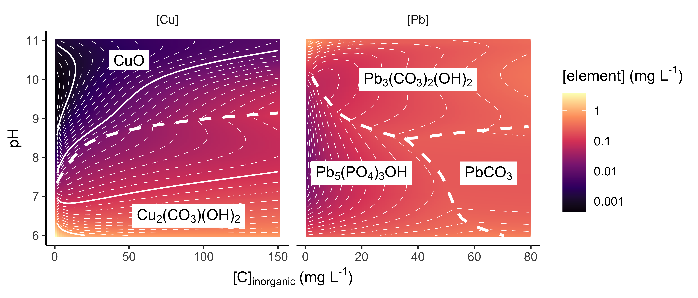

<!-- README.md is generated from README.Rmd. Please edit that file -->

# pbcusol

<!-- badges: start -->

[](https://github.com/bentrueman/pbcusol/actions)
[](https://app.codecov.io/gh/bentrueman/pbcusol?branch=main)
<!-- badges: end -->

`pbcusol` predicts equilibrium lead and copper solubility using the US
EPA databases LEADSOL (Schock et al. 1996) and CU2SOL (Schock et al.,
1995), along with those available as a part of PHREEQC (Charlton and
Parkhurst, 2011; Parkhurst and Appelo, 2013). `pbcusol` uses
`tidyphreeqc` (Dunnington, 2019)—a convenient interface for PHREEQC in
R—for most solubility computations.

## Installation

You can install the development version from
[GitHub](https://github.com/) with:

``` r
# install.packages("remotes")
remotes::install_github("bentrueman/pbcusol")
```

## Example

For this example, you will need the `tidyverse` family of packages,
along with `plyr::round_any()`, and `viridis::scale_fill_viridis()`.

``` r
library("pbcusol")
library("tidyverse")
library("viridis")
```

Use `eq_sol()` to calculate the equlibrium solubility of multiple copper
phases that occur in drinking water systems, over a wide range of pH
values and dissolved inorganic carbon concentrations. (N.B., evaluate on
a smaller grid to speed this up!)

``` r
dic_increment_cu <- 1.5
solutions_cu <- list("Cu(OH)2", "Tenorite", "Malachite") %>%
  set_names() %>%
  map_dfr(
    ~eq_sol(
      element = "Cu",
      ph = seq(6, 11, by = .025),
      dic = seq(1, 150, by = dic_increment_cu),
      phase = .x
    ),
    .id = "phase"
  )
```

Plot the data (n.b., plots shown here will differ slightly from those
the following code generates). Lytle et al. (2018) have noted that
copper solubility predictions are not reliable in the presence of
orthophosphate, and they propose an empirical model as an alternative.
It is implemented in `eq_sol()` via the argument `empirical = TRUE`.

``` r
solutions_cu %>% 
  mutate(
    log10_cu_ppb = log10(cu_ppb),
    dic_ppm = plyr::round_any(dic_ppm, dic_increment_cu)
  ) %>% 
  ggplot(aes(x = dic_ppm, y = pH)) + 
  facet_wrap(vars(phase)) + 
  geom_raster(aes(fill = log10_cu_ppb)) +
  geom_contour(aes(z = log10_cu_ppb), col = "white") +
  viridis::scale_fill_viridis(option = "magma")
```

 Use
`eq_sol()` to make the same predictions for lead. The helper function
`calculate_dic()` may be useful for converting alkalinity to dissolved
inorganic carbon.

``` r
dic_increment_pb <- .8
solutions_pb <- list("Cerussite", "Hydcerussite", "Hxypyromorphite") %>%
  set_names() %>%
  map_dfr(
    ~ eq_sol(
      element = "Pb",
      ph = seq(6, 11, by = .025),
      dic = seq(1, 80, by = dic_increment_pb),
      phosphate = .16,
      phase = .x
    ),
    .id = "phase"
  )
```

Plot the data:

``` r
solutions_pb %>% 
  mutate(
    log10_pb_ppb = log10(pb_ppb),
    dic_ppm = plyr::round_any(dic_ppm, dic_increment_pb)
  ) %>% 
  ggplot(aes(x = dic_ppm, y = pH)) + 
  facet_wrap(vars(phase)) + 
  geom_raster(aes(fill = log10_pb_ppb)) +
  geom_contour(aes(z = log10_pb_ppb), col = "white") +
  viridis::scale_fill_viridis(option = "magma")
```


Combining the information in the previous two plots, we can generate
prediction surfaces for equilibrium lead and copper solubility that are
quite close to those presented in literature, specifically Figure 7 in
Schock et al. (1995) and Figure 4-18 in Schock et al. (1996).



Use `pb_logk()` and `cu_logk()` to generate tables of the relevant
reactions and constants in the LEADSOL and CU2SOL databases. N.B.,
`pbcusol` uses a modified version of `phreeqc::minteq.dat` that include
the data from LEADSOL and CU2SOL. N.B., `phreeqc::minteq.dat` includes
two reactions describing complexation of copper and chloride that are
not included in Schock et al. (1995).

### Surface complexation (experimental)

Metal binding to natural organic matter can be modeled using
`eq_sol_wham()`, an approximation of the Windermere Humic Aqueous Model
(WHAM) (Tipping and Hurley, 1992), as described in Example 19 of
Parkhurst and Appelo (2013).

``` r
eq_sol_wham(
  element = "Pb", 
  ph = 7.5, 
  dic = 50, 
  phase = "Cerussite", 
  Na = 4, 
  mass_ha = 3.5e-3
) %>% 
  transmute(
    phase, pH, dic_ppm, 
    solution_pb = pb_ppb, 
    total_pb = mol_Cerussite * 1e6 * 207.21
  )
#> # A tibble: 1 × 5
#>   phase        pH dic_ppm solution_pb total_pb
#>   <chr>     <dbl>   <dbl>       <dbl>    <dbl>
#> 1 Cerussite   7.5    50.1        217.    1162.
```

Metal binding to colloidal ferrihydrite can be modeled using
`eq_sol_fixed()` (or `eq_sol_wham()`), as described in Example 8 of
Parkhurst and Appelo (2013).

``` r
# from Example 8:
hfo_surface_area <- 600                                   # m^2 / g
strong_density <- 5e-6 / (hfo_surface_area * .09)         # site density in mol / m^2 
weak_density <- 2e-4 / (hfo_surface_area * .09)           # site density in mol / m^2 
hfo_mass <- 1.7e-4                                        # grams of colloidal ferrihydrite (1e-4 g Fe/L)
hfo_s <- hfo_mass * hfo_surface_area * strong_density     # number of strong binding sites
hfo_w <- hfo_mass * hfo_surface_area * weak_density       # number of weak binding sites

# define surface:
fer_surf <- list(
    Hfo_sOH = c(hfo_s, hfo_surface_area, hfo_mass),
    Hfo_wOH = hfo_w,
    "-equilibrate" = 1,
    "-Donnan"
    )

eq_sol_fixed(
  element = "Pb", 
  ph = 7.5, 
  dic = 5, 
  phosphate = .3, 
  phase = "Hxypyromorphite", 
  surface_components = fer_surf
) %>% 
  transmute(
    phase, pH, dic_ppm, p_ppm, 
    solution_pb = pb_ppb, 
    total_pb = mol_Hxypyromorphite * 1e6 * 207.21 * 5
  )
#> # A tibble: 1 × 6
#>   phase              pH dic_ppm p_ppm solution_pb total_pb
#>   <chr>           <dbl>   <dbl> <dbl>       <dbl>    <dbl>
#> 1 Hxypyromorphite   7.5    5.00 0.303        19.7     38.0
```

# References

Charlton, S.R., and D. L. Parkhurst. 2011. Modules based on the
geochemical model PHREEQC for use in scripting and programming
languages. Computers & Geosciences, v. 37, p. 1653-1663.

Dunnington, D. 2019. tidyphreeqc: Tidy Geochemical Modeling Using
PHREEQC. <https://github.com/paleolimbot/tidyphreeqc>.

Lytle, D. A., M. R. Schock, J. Leo, and B. Barnes. 2018. A model for
estimating the impact of orthophosphate on copper in water. Journal
AWWA. 110: E1-E15.
<https://doi-org.ezproxy.library.dal.ca/10.1002/awwa.1109>

Parkhurst, D. L., and C. A. J. Appelo. 2013. Description of input and
examples for PHREEQC version 3–A computer program for speciation, batch-
reaction, one-dimensional transport, and inverse geochemical
calculations: U.S. Geological Survey Techniques and Methods, book 6,
chap. A43, 497 p. <http://pubs.usgs.gov/tm/06/a43>.

Schock, M. R., D. A Lytle, and J. A. Clement. 1995. “Effect of pH, DIC,
orthophosphate and sulfate on drinking water cuprosolvency.” National
Risk Management Research Lab., Cincinnati, OH (United States).

Schock, M. R., I. Wagner, and R. J. Oliphant. 1996. “Corrosion and
solubility of lead in drinking water.” In Internal corrosion of water
distribution systems, 2nd ed., p. 131–230. Denver, CO: American Water
Works Association Research Foundation.

Tipping, E., and M. A. Hurley. 1992. A unifying model of cation binding
by humic substances. Geochimica et Cosmochimica Acta, v. 56, no. 10,
p. 3627-3641.
